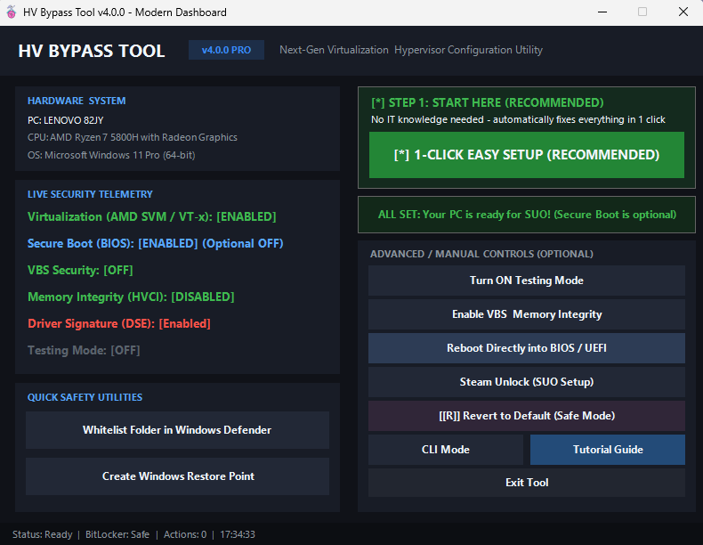
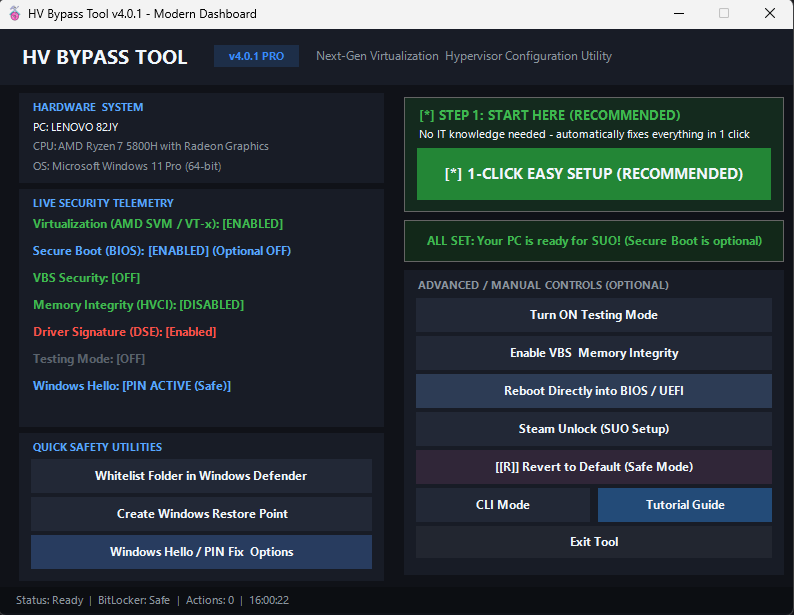
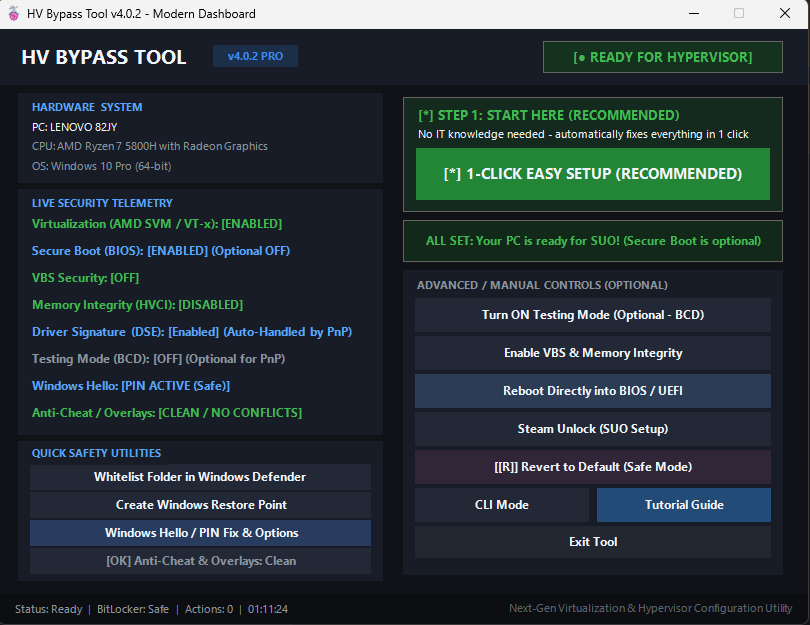
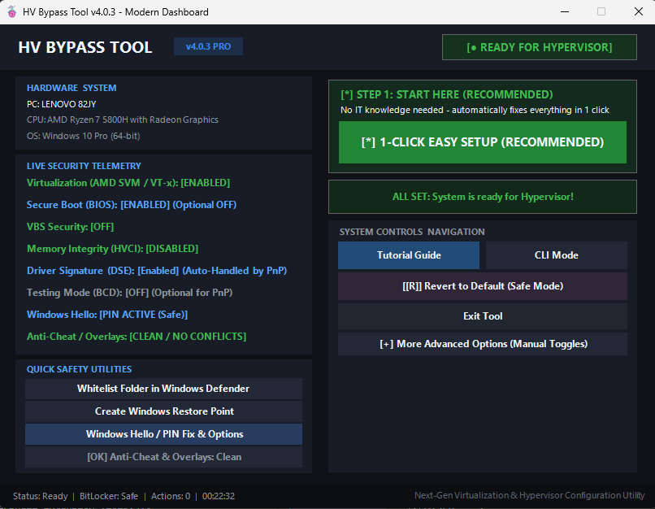

# #HV Tools

• Automatically Detects Motherboard Brand
• Auto-Detect BIOS Boot Types (UEFI/Legacy)
• Auto-detect DSE/Virtualization
• Automatically find a YouTube link to guide on enabling virtualization
• Auto Refresh Panel
• More Error Handler
• Window Hello detection
• Testing Mode ON/OFF
• Add Win Hello Disable guide/bypass
• Dynamic Run VBS button
• Auto Detect Custom OS
• CLI mode added
• SUO setup
• Latest VBS 1.9
# **Please Off Antivirus before using it**

---

#HV Tools

---

latest version. just need 1 click then restart. after that can play HV game via PlugNPlay.bat

[Download Tools_V4.0.exe (0.1 MB)](assets/hv-tools_1545081721014456330.exe)

---

---

V4.0.1 added automation on Windows Hello fix to un-gray remove button on the VBS step

[Download Tools_V4.0.1.exe (0.1 MB)](assets/hv-tools_1545705780647301140.exe)

---

V4.0.2 update for MSI afterburner user conflict with HV, add BIG indicator PC can run HV game

[Download Tools_V4.0.2.exe (0.1 MB)](assets/hv-tools_1546931347459805244.exe)

---

# **Changed in V4.0.3**
* 1 Click button - add auto restart PC 
* Fix HV error `0xC035001E` "*hypervisor feature is not available to the user*" at launch crash.
* Cleaned Up UI - less clutter.
* New Status Badge: [Not Ready For Hypervisor]
* Telemetry - Fix false-positive detection Windows Hyper-V

[Download Tools_V4.0.3.exe (0.1 MB)](assets/hv-tools_1548014219851468870.exe)
