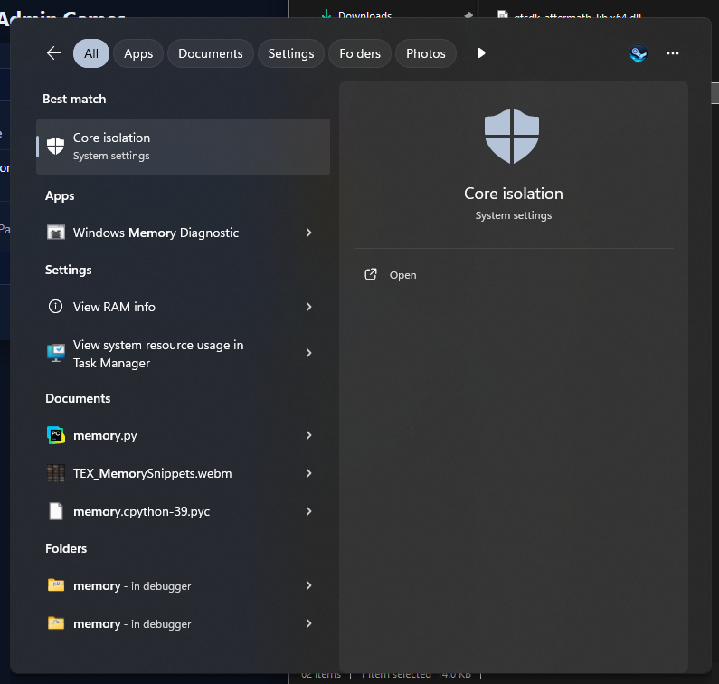
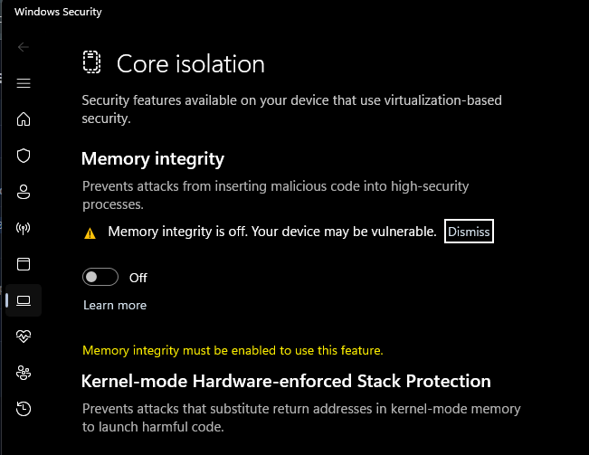

# Crimson Desert - 3321460

# Follow this guide
https://discord.com/channels/333191744873299978/1499122656686116944

## **Prequisites Guide**
1. Before Downloading game, launch CloudRedirect from Tools section or download from 
https://github.com/Selectively11/CloudRedirect/releases/latest
2. Follow guide completely at <#1495014736515829760> 
3. Manifest pinning via CloudRedirect.

## **Bypass Hypervisor Guide**
1. Turn off Memory Intergrity in Core Isolation (by default it should be off)
2. Turn off Antivirus (real-time protection)
3. Download game** [GAMENAME]** from Steam
4. Click Bypass Game in Steam Unlock

## **Launch Option**
1. Open from Steam Unlock, click PLAY, choose exe and choose HV-PlugNPlay.bat/HV-Launcher.bat **(only work at Win 11)**
2. Run game from HV-PlugNPlay.bat or HV-Launcher.bat or **[GAMENAME].exe**
3. Run from steam but need use this tools HVPNP.exe at <#1426551342540783858>






---

<:5726toothymaw:1239134161835655198>

---

Using Crack: Voices38

1) Add game from SUO
2) Off antivirus(realtime protection) and smart app control (win 11)
3) Download game from steam
4) Make sure game already complete download and open ```SUO > Library > Gamename > Click bypass```
5) play from steam
