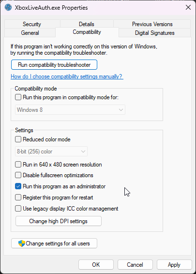
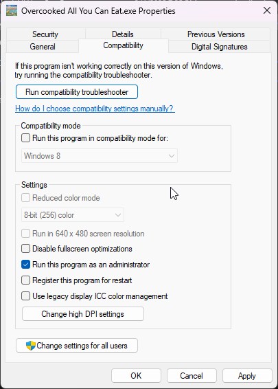
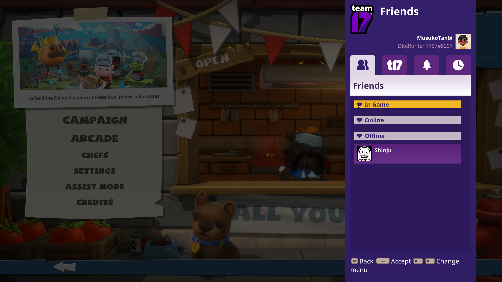

# Overcooked! All you can eat Online method- 1243830

- Go to Game installation folder
- Set the game `Overcooked All You Can Eat.exe` run as admin, and also the `XboxLiveAuth.exe` run as admin too. 
- Launch the game using  `XboxLiveAuth.exe` and choose online. The game works and connected to your Xbox account

NOTE: Make sure your XBOX /Microsoft email account used to log in is the same in Microsoft Store account and disable 2FA. Suggest to create new dummy account for XBOX/Microsoft.

---

Overcooked! All you can eat Online method- 1243830
